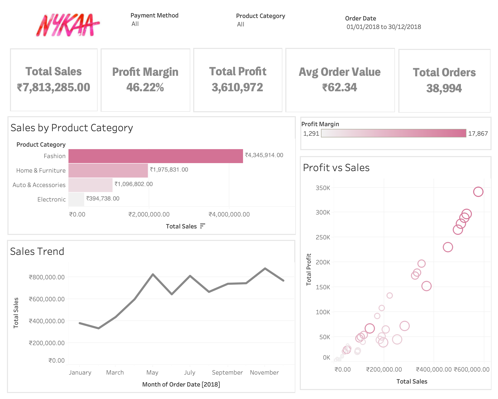
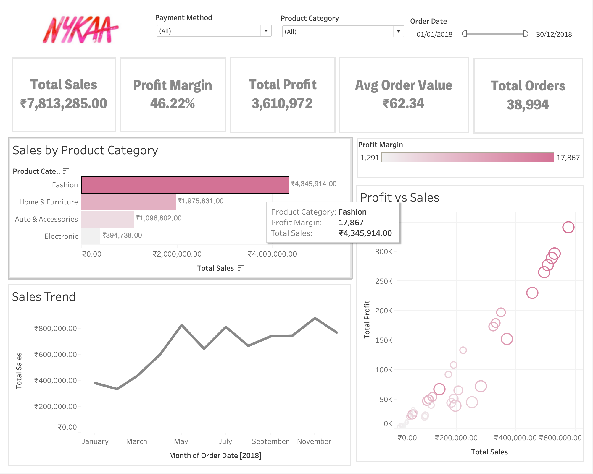
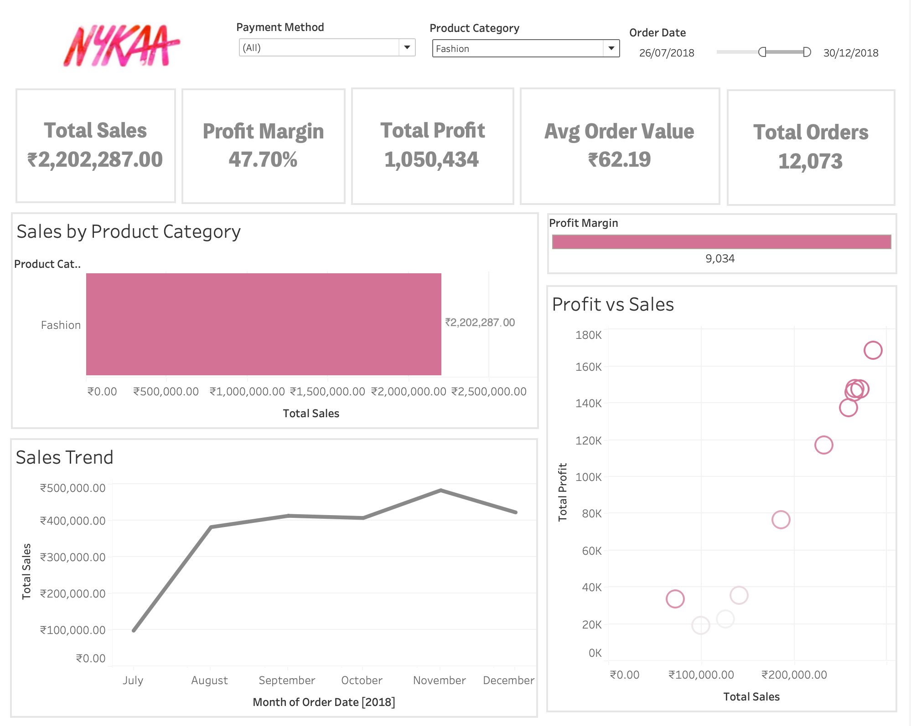

# Nykaa Beauty Analytics 📊💄

## Overview

This project presents a data-driven analysis of **Nykaa’s beauty e-commerce performance**, focusing on sales trends, profitability, customer behavior, and product performance.
The objective is to convert raw transactional data into **clear business insights** using analytics and visualisation.

An interactive **Tableau dashboard** complements the analysis to support strategic decision-making.

---

## Business Objectives

* Analyse **sales and profit trends** over time
* Identify **top-performing categories and products**
* Understand **customer purchasing behavior**
* Evaluate **profitability across segments**
* Present insights through a **visual, stakeholder-ready dashboard**

---

## Tools & Technologies

* **Python** (Pandas, NumPy) – data cleaning & analysis
* **Jupyter Notebook** – exploratory data analysis (EDA)
* **Tableau** – dashboard & visual storytelling
* **VS Code** – development environment
* **Git & GitHub** – version control & project sharing

---

## Project Structure

```
nykaa-beauty-analytics/
│
├── data/               # Raw and processed datasets
├── notebooks/          # Jupyter notebooks (EDA & analysis)
├── dashboard/          # Tableau dashboard files & screenshots
├── outputs/            # Exported visuals / supporting images
├── README.md
└── .gitignore
```

---

## Key Insights

* A small set of beauty categories contributes to **a majority of revenue**
* **Repeat customers** drive higher average order value
* Profit margins vary significantly across product types
* Seasonal patterns influence both **sales volume and revenue**

---

## Dashboard Preview

Below are snapshots from the Tableau dashboard:





> 📌 *The full interactive dashboard file is available in the `dashboard/` folder.*

---

## Business Impact

This analysis can help businesses:

* Optimise **product assortment and inventory**
* Improve **pricing and discount strategies**
* Identify and target **high-value customers**
* Support **data-backed marketing decisions**

---

## How to Run This Project

1. Clone the repository:

   ```bash
   git clone https://github.com/Ishitanadar/nykaa-beauty-analytics.git
   ```
2. Open the project in **VS Code**
3. Explore analysis notebooks inside the `notebooks/` folder
4. View dashboard screenshots in the `dashboard/` folder
5. Open the Tableau dashboard file using **Tableau Desktop / Tableau Public**

---

## Author

**Ishita Nadar**
SEO Analyst | Aspiring MBA | Data & Business Analytics
GitHub: [https://github.com/Ishitanadar](https://github.com/Ishitanadar)
